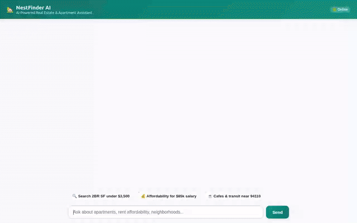

# 🏡 NestFinder AI — Intelligent Real Estate & Apartment Search Agent

An AI-powered real estate assistant built with the **Google Agent Development Kit (ADK)**. NestFinder AI helps users search apartment listings, analyze rent affordability, explore neighborhood amenities via Google Maps, generate visual apartment renderings, and create virtual video walk-throughs — complete with cross-session user memory and rich **A2UI** component rendering.



---

## 🚀 Features & Tools

NestFinder AI integrates specialized tools and Google Cloud services to deliver an interactive apartment search experience:

* **Apartment Search & Database Lookup (`search_listings`)**
  * Queries real-time apartment listings stored in **Google Cloud Firestore**.
  * Filters available properties by neighborhood, budget limit, bedroom count, and pet policy.
* **Affordability Calculator (`calculate_affordability`)**
  * Evaluates annual salary and monthly income against the 30% gross income rule to calculate recommended maximum monthly rent.
* **Google Maps Neighborhood Exploration**
  * `geocode_address`: Converts property addresses into precise latitude/longitude coordinates.
  * `lookup_zip_code_info`: Provides neighborhood market context for specific ZIP codes.
  * `find_nearby_places`: Discovers nearby transit stations, cafes, grocery stores, and parks using Google Maps Places API.
* **Tour Booking (`book_tour`)**
  * Schedules in-person or virtual property walk-throughs.
* **AI Visual Image Generation (`generate_apartment_image`)**
  * Generates high-quality realistic apartment renderings using **Gemini image generation** (`gemini-3.1-flash-lite-image`).
  * Saves images as ADK artifacts and uploads bytes directly to **Google Cloud Storage**.
* **Virtual Video Walk-throughs (`generate_apartment_tour_video`)**
  * Generates short virtual property tour videos using Google's **Omni model** (`gemini-omni-flash-preview`) in the `global` region.
  * Saves videos as ADK artifacts and uploads bytes to Google Cloud Storage.
* **Persistent Memory Bank (`PreloadMemoryTool` & Vertex AI Memory Bank)**
  * Retains cross-session user preferences, health/pet constraints, and allergy requirements across conversations.
* **Rich Dynamic Interface (A2UI)**
  * Dynamically emits rich **A2UI** component layouts (Cards, Columns, Rows, Text, Images) rendered natively by the frontend.

---

## 🛠️ Architecture & Documentation

* **Agent Framework:** Google Agent Development Kit (ADK) with `gemini-2.5-flash` model.
* **Agent Runtime:** Deployed to Vertex AI Reasoning Engine with Agent-to-Agent (A2A) protocol support.
* **Database:** Google Cloud Firestore (`apartments` collection).
* **Media Storage:** Google Cloud Storage bucket (`nestfinder-media-*`).
* **Location & Places:** Google Maps Geocoding API & Places API.
* **Frontend:** Minimal FastAPI proxy with custom responsive chat UI and A2UI JSON rendering engine.
* **Detailed Command Reference:** See [`COMMANDS.md`](COMMANDS.md) for step-by-step CLI commands for setup, deployment, demo recording, and GitHub publishing.


---

## 💻 Local Setup & Execution Instructions

### Prerequisites
* Python 3.11+
* `uv` or `pip` package manager
* Google Cloud SDK (`gcloud`) authenticated with a GCP project

### 1. Install Dependencies
```bash
pip install -r requirements.txt
```

### 2. Configure Environment Variables
Set the required API keys and agent configuration:
```bash
export GOOGLE_MAPS_API_KEY="your-google-maps-api-key"
export AGENT_DIRECTORY="app"
```

### 3. Run Agent Frontend Locally
Navigate to the `frontend/` directory and start the local proxy server:
```bash
cd frontend
pip install -r requirements.txt
python main.py
```
The application server will start on port `8080`. Open your web browser and navigate to `http://localhost:8080`.

### 4. Deploy Agent to Vertex AI Agent Runtime
To deploy or update the agent on Google Cloud Vertex AI Reasoning Engine:
```bash
agents-cli deploy --no-confirm-project --update-env-vars GOOGLE_MAPS_API_KEY=your-api-key
```

---

## 📄 License
Licensed under the Apache License, Version 2.0.
